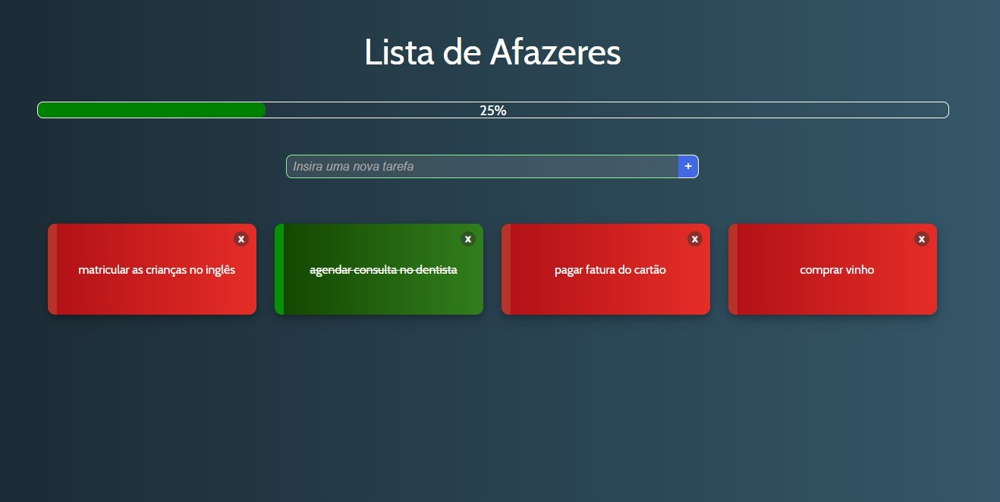

# Simple Vue.js CRUD Application

- **Author:** [Julio L. Muller](https://github.com/juliolmuller)
- **Released on:** Apr 8, 2020
- **Updated on:** Apr 8, 2020
- **Latest version:** 1.0.0
- **License:** MIT

## Overview

Application developed to demonstrate a functional CRUD application (create, read, update & delete data) using the JavaScript framework Vue 2. This a front-end application which "persists" data in *localStorage*.

## Run Application

Take a look at this application running through [this link](https://juliolmuller.github.io/crud-vuejs).

## Project setup

Run `npm install` to download all dependecnies and get the project set up.

## Development server

Run `npm run serve` for a dev server. Navigate to `http://localhost:8080/`. The app will automatically reload if you change any of the source files.

## Build

Run `npm run build` to build the project. The build artifacts will be stored in the `dist/` directory.
